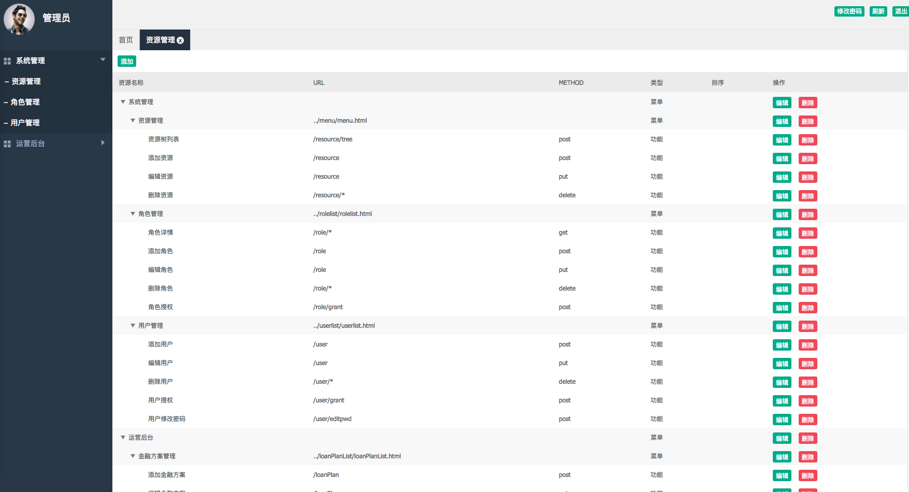
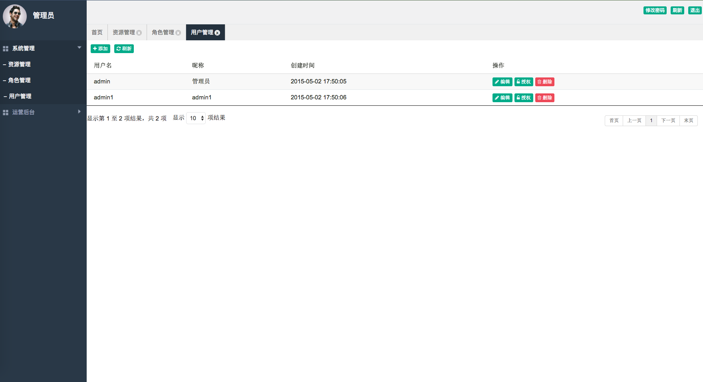

## 简介

[kotlin版本](https://github.com/sail-y/spring-boot-admin-kotlin)

[java版本](https://github.com/sail-y/spring-boot-admin)

简单的后台开发模板框架，具备用户管理，菜单管理和角色管理3个功能，权限控制到按钮层级。       

采用JWT+Spring Security进行权限验证和会话保持
项目基于Spring boot+Mybatis+BootStrap+DataTables

## 相关框架
* [Spring boot](http://projects.spring.io/spring-boot/)
* [Mybatis](http://www.mybatis.org/mybatis-3/zh/index.html)
* [druid](https://github.com/alibaba/druid)
* [lombok](https://projectlombok.org/)
* [backbone.js](http://backbonejs.org/)
* [bootstrap](http://getbootstrap.com/)
* [datatables](https://datatables.net/)

## 修改application-dev.yml里的数据库连接

执行`mysql -uroot -p 数据库 < dmc.sql`导入数据库脚本。

直接Run`DMCApplication`启动后访问：http://localhost:10000/web/views/login/login.html

帐号：admin            
密码：111111

## 页面展示

